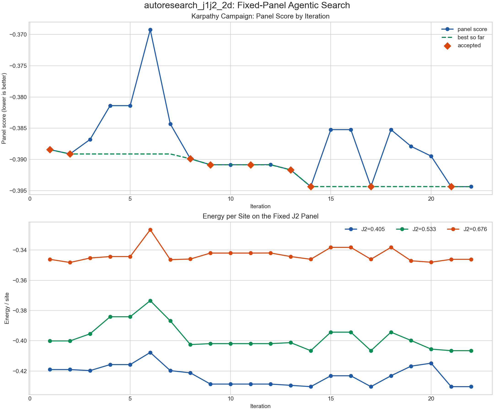

# Autoresearch for Quantum Many-Body Physics

## Worked Example: J1-J2 Heisenberg 2D Recipe Search

This repository studies transformer-based neural quantum states for the frustrated
spin-1/2 J1-J2 Heisenberg model on the periodic 4x4 square lattice.

> **Ongoing work**
> This repository is an active research prototype. The current best recipe is
> useful and reproducible, but it should still be treated as exploratory rather
> than as a final scientific claim.

The workflow is inspired by Andrej Karpathy's
[`autoresearch`](https://github.com/karpathy/autoresearch): keep the task setup
fixed, let an automated process modify the mutable training recipe, and evaluate
each proposal against a stable benchmark. Here that idea is adapted to quantum
many-body variational calculations, where the Hamiltonian, lattice, and
reference diagnostics stay fixed while `train.py` is optimized.

The project is organized around a simple separation of concerns:

- `prepare.py` and `exact_diag.py` define the fixed physics and exact-reference benchmarks.
- `train.py` contains the mutable variational ansatz and training recipe.
- the `controller/` utilities run short automated searches and post-training evaluations.

## Scientific Goal

The immediate goal is not large-scale production benchmarking, but a controlled
study of automated recipe search for a difficult frustrated quantum many-body
problem where exact diagonalization is still available for validation.

More broadly, this repository is intended as a concrete worked example of
autoresearch-style methodology for quantum many-body physics.

This makes the repository useful for:

- testing optimization heuristics for neural quantum states,
- comparing short-budget search recipes against exact 4x4 references,
- building a reproducible workflow before scaling beyond exact-diagonalization regimes.

## Current Scope

- Model: spin-1/2 J1-J2 Heisenberg antiferromagnet on a periodic 4x4 square lattice
- Reference validation: exact diagonalization on 4x4
- Mutable component: `train.py`
- Fixed components: `prepare.py`, `exact_diag.py`, panel evaluation, and post-training evaluation
- Role in the broader project: first worked example / pilot benchmark

## Repository Layout

```text
.
├── prepare.py
├── train.py
├── exact_diag.py
├── program.md
├── controller/
│   ├── run_agentic_loop.py
│   ├── run_panel_eval.py
│   ├── run_direct_experiment.py
│   ├── run_direct_batch.py
│   └── post_training_eval.py
├── docs/
│   ├── DIRECT_EDIT_WORKFLOW.md
│   ├── METHODOLOGY.md
│   ├── RESULTS.md
│   └── figures/
├── notebooks/
│   └── j1j2_results_dashboard.ipynb
└── tests/
```

Runtime artifacts such as `results/`, `logs/`, local environments, and secrets are
intentionally excluded from version control.

## Quick Start

```bash
python -m venv .venv
source .venv/bin/activate
pip install -r requirements.txt

python prepare.py
python exact_diag.py
TV_DEVICE=cpu python train.py --j2 0.0 --sector sz0 --max-steps 10
```

## Search Workflows

### API-driven iterative search

```bash
cp .env.example .env
# add GEMINI_API_KEY and/or GROQ_API_KEY

./run_campaign.sh
./run_campaign.sh --resume
```

### Direct-edit keep/discard workflow

This mode treats `train.py` as the only mutable file and evaluates the current
version against a fixed panel:

```bash
.venv/bin/python controller/run_direct_experiment.py \
  --campaign-dir results/fixed_panel_search \
  --description "brief description of the change" \
  --max-steps 50
```

More details are in [docs/DIRECT_EDIT_WORKFLOW.md](docs/DIRECT_EDIT_WORKFLOW.md).

### Post-training comparison

```bash
.venv/bin/python controller/post_training_eval.py \
  --baseline-path results/fixed_panel_search/initial_train.py \
  --candidate-path results/fixed_panel_search/best_train.py \
  --output-dir results/post_training_eval_example \
  --j2-values 0.0 0.5 1.0 \
  --seeds 11 \
  --steps 50
```

## Public Result Snapshot

The current curated snapshot is summarized in [docs/RESULTS.md](docs/RESULTS.md).
In short:

- a short-budget fixed-panel search improved the panel score from `-0.388431` to
  `-0.394357` over 22 evaluated iterations;
- the winning recipe increased batch size, used centered advantages, extended
  warmup, and reduced regularization;
- a separate post-training benchmark showed that this short-budget winner is
  promising as an optimization recipe, but not yet clearly better as a final
  trained model across all anchor points.



That distinction is important: the repository already demonstrates useful
automated search behavior, but the current best short-budget recipe should still
be treated as exploratory rather than definitive.

## Documentation

- [docs/METHODOLOGY.md](docs/METHODOLOGY.md): benchmark design and evaluation protocol
- [docs/RESULTS.md](docs/RESULTS.md): curated public result summary
- [docs/DIRECT_EDIT_WORKFLOW.md](docs/DIRECT_EDIT_WORKFLOW.md): direct-edit search loop
- [security_best_practices_report.md](security_best_practices_report.md): publication-focused privacy and security audit
- [notebooks/j1j2_results_dashboard.ipynb](notebooks/j1j2_results_dashboard.ipynb): interactive comparison of exact references vs model output
- [INSTRUCTIONS.md](INSTRUCTIONS.md): contributor-oriented runbook

## Limitations

- The main benchmark is finite-size 4x4, so phase-diagram conclusions are limited.
- The direct-edit search currently optimizes short-budget panel performance.
- Large-scale claims for 6x6 or beyond would require a new validation protocol.
