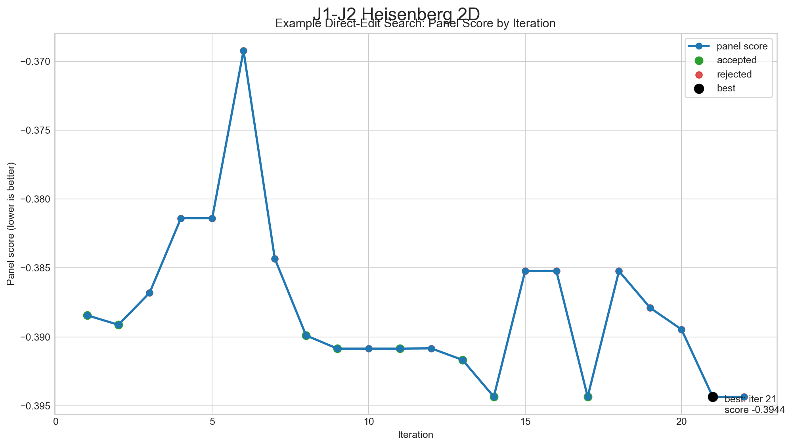

# Curated Results

This document summarizes the current public result snapshot from the repository.
Generated search directories are excluded from version control; the numbers
below are the curated outcomes retained for documentation.

These results should be read as outcomes from the first worked example of
autoresearch for quantum many-body physics, not yet as a mature benchmark suite.

## 1. Fixed-Panel Direct-Edit Search

The direct-edit search evaluated 22 candidate recipe states under a fixed
50-step panel with panel seed `10000`.

Key outcome:

- initial fixed-panel score: `-0.388431`
- best fixed-panel score: `-0.394357`
- absolute improvement: `-0.005926`
- winning iteration: `21`

### Winning Recipe

Relative to the initial direct-edit baseline, the best short-budget recipe used:

- `BATCH_SIZE = 512` instead of `256`
- `WEIGHT_DECAY = 0.0` instead of `1e-5`
- `GRAD_CLIP_NORM = 0.5` instead of `1.0`
- `LR_WARMUP_FRACTION = 0.1` instead of `0.05`
- `LR_FINAL_MULTIPLIER = 0.2` instead of `0.1`
- `ADVANTAGE_TYPE = "centered"` instead of `"zscore"`
- `BASELINE_TYPE = "median"` unchanged

Interpretation:

- the automated search found a better short-budget optimization recipe,
- most gains came from larger batches and a gentler schedule,
- the search behaved sensibly by rejecting multiple learning-rate regressions.

## 2. Post-Training Anchor Evaluation

The more important question is whether the short-budget winner also produces a
better trained model. A post-training comparison was run on the anchor set
`J2 = {0.0, 0.5, 1.0}` with one seed and a 50-step budget.

### Overall Metrics

| config | steps | MAE E/N (sz0) | Max error | MAE gap | mean Var(E_loc)/N^2 |
|---|---:|---:|---:|---:|---:|
| baseline | 50 | 0.176212 | 0.273329 | 0.519126 | 0.016116 |
| champion | 50 | 0.177819 | 0.274986 | 0.504956 | 0.016166 |

### Reading This Result

- the champion improved the sector-gap metric slightly,
- it performed a bit better at `J2 = 0.0`,
- it did not beat the baseline cleanly in overall energy MAE at this budget,
- therefore the current champion is best interpreted as a promising optimization
  recipe rather than a confirmed better final model.

## 3. Current Scientific Status

The repository already demonstrates a meaningful automated-search signal:

- it can improve a fixed short-budget benchmark in a reproducible way,
- it logs accepted and rejected ideas cleanly,
- it can validate candidate recipes against exact diagonalization after search.

At the same time, the current evidence is still exploratory:

- larger post-training budgets are still needed,
- multiple seeds should be included in the public benchmark,
- conclusions beyond 4x4 would require a different validation strategy.
